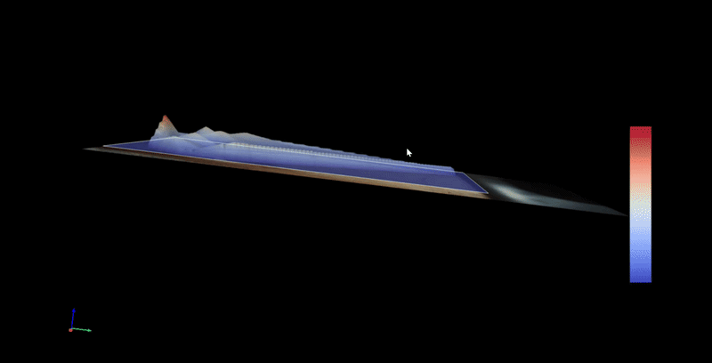
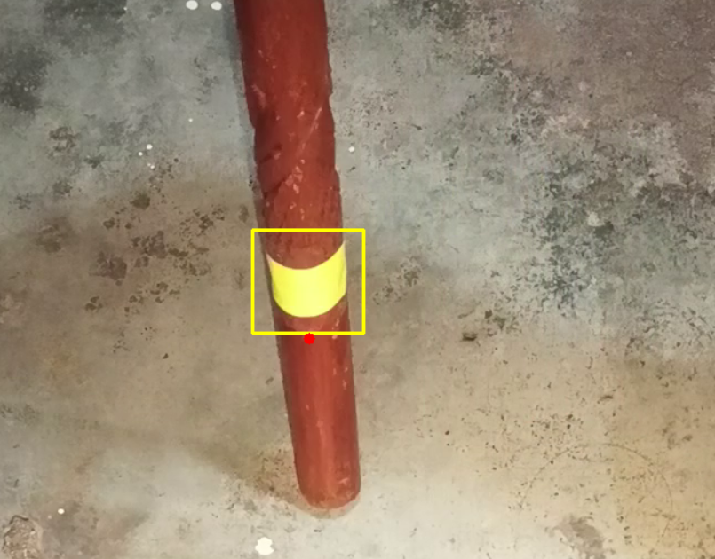
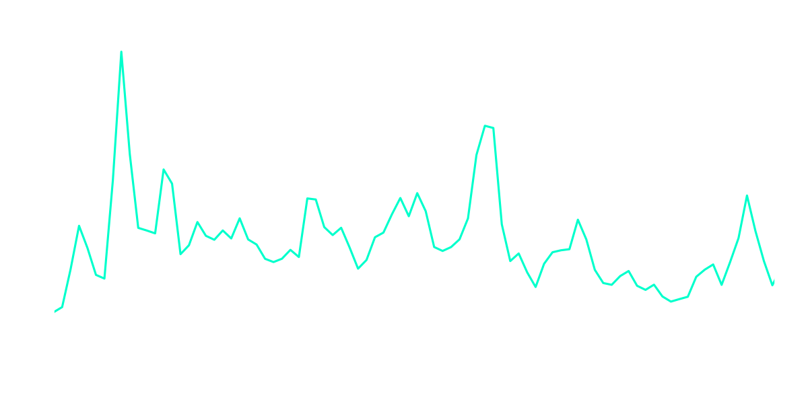
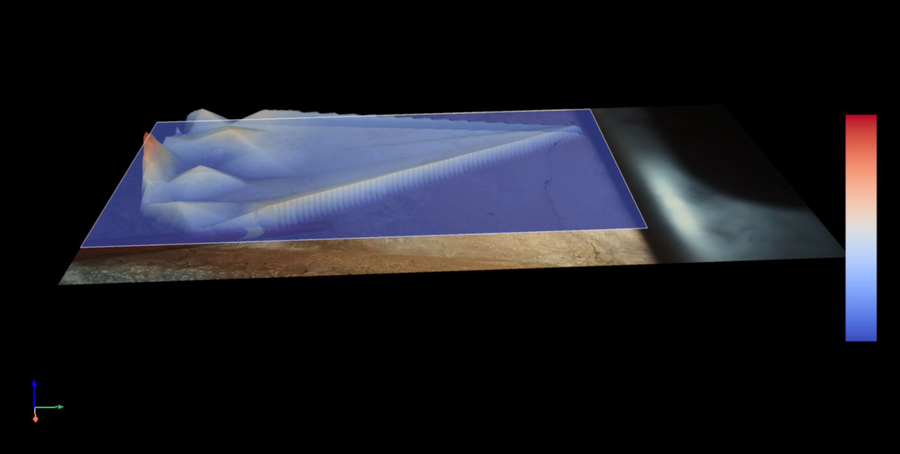

# Hollowness using Acoustic Relative Detection, Non-Destructive Testing (HARD, NDT)



**HARD NDT** is an experimental Acoustic Surface Tomography pipeline designed to detect "hollowness" in solid surfaces (like concrete) using audio transients and computer vision.

By striking a surface with a physical probe, the system analyzes the resonant decay of the impact. It then uses a camera to track the physical location of the strike, mapping the acoustic properties into a 3D topographic heat map using PyVista.

---

## Repository Philosophy

This repository intentionally documents an AI-assisted engineering workflow.

Rather than manually writing every component from scratch, this project explored:
- iterative AI-assisted prototyping,
- architectural experimentation,
- debugging AI-generated code,
- validating mathematical assumptions,
- and learning how to manage a complex technical project.

The emphasis was placed on:
- understanding the system,
- modifying and validating outputs,
- and learning engineering workflow constraints,
not on claiming authorship purity.

This repository should therefore be viewed as:
- an engineering learning artifact,
- an experimental prototype,
- and a documentation of process-driven learning.

---

## System Architecture

The pipeline processes asynchronous audio and video streams, synchronizes them using physical laws (speed of sound), and interpolates them into a 3D mesh. 

```text
Camera Video Stream                                       External High-Fidelity Audio
        │                                                              │
        ▼                                                              ▼
 VisionTracker (OpenCV)                                 AudioDSP (Librosa/SciPy)
 ├─ HSV Marker Isolation                                ├─ Transient Onset Detection
 ├─ Morphological Smoothing                             ├─ Impact Tail Slicing
 └─ Physical XY Centroid Estimation                     ├─ FFT Spectral Analysis (100-800Hz)
        │                                               └─ Baseline Scoring (0.0 to 1.0)
        │                                                              │
        └──────────────────────────┐   ┌───────────────────────────────┘
                                   ▼   ▼
                           DataFusion (NumPy)
                           ├─ Temporal Synchronization (Audio - Delay = Video)
                           └─ 3D Grid Interpolation
                                   │
                                   ▼
                           Renderer (PyVista/VTK)
                           ├─ Heatmap Colorization
                           └─ Z-Axis Topographic Deformation
```

For more details on why the codebase is structured this way, see [docs/ARCHITECTURE.md](docs/ARCHITECTURE.md). For the exact mathematical formulas governing the spatial and temporal synchronizations, see [docs/math_explanation.tex](docs/math_explanation.tex) or [docs/math_explanation.md](docs/math_explanation.md).

---

## Visual Proof & Outputs

Below are examples of the intermediate and final outputs of the pipeline.

**1. OpenCV Marker Tracking**


**2. Acoustic DSP / FFT Analysis**


**3. PyVista 3D Heatmap Overlay**


**4. Physical Hardware Setup**


---

## Technical Challenges

Some of the more difficult problems encountered during development included:

- **Rebound Parallax Error**: Synchronizing acoustic timestamps with video frames and compensating for the speed of sound delay. Light travels faster than sound, meaning the visual strike happens *before* the microphone hears it.
- **OpenCV to VTK Inversion**: Correcting spatial coordinate inversions between 2D OpenCV tracking arrays and 3D PyVista camera projections.
- **Acoustic Contamination**: Handling FFT instability from inconsistent impacts and environmental echo contamination in reverberant rooms.
- **Dependency Conflicts**: Managing notorious compatibility issues with `vtk`, `pyvista`, and `cffi` on Windows.

---

## Validation Status

Current validation is limited and highly experimental.

The system has only been tested on:
- small-scale indoor surfaces,
- limited environmental conditions,
- and non-standardized hardware setups.

**Crucially, there is no way to formally verify the absolute accuracy of the output without physically breaking the concrete floor to prove where the hollow voids exist.** 

No formal scientific benchmarking or industrial calibration has been performed. Results should therefore be treated as exploratory rather than authoritative.

---

## Future Research Directions

Future improvements could drastically increase the fidelity of the pipeline:

- **Machine Learning Classification**: Training an ML model on the FFT data rather than relying on standard Euclidean distance baselines.
- **Real-Time Processing**: Porting the pipeline from offline batch processing to a real-time AR feed.
- **Multiple Microphones**: Using an array of microphones to triangulate the strike acoustically, reducing reliance on visual tape tracking.
- **Depth Estimation**: Using a stereo camera or LiDAR to map uneven floors instead of assuming a perfectly flat 2D projection plane.

---

## Setup & Installation

### Python Compatibility

This project is currently tested primarily on:
- **Python 3.11.9 (Recommended)**

Versions outside the 3.10–3.12 range may fail due to compatibility issues with `PyVista`, `VTK`, and related C-bindings (`cffi`). If installation fails, first verify your Python version before debugging anything else.

### Installation

Clone the repository and install the dependencies:

```bash
git clone https://github.com/yourusername/acoustic_tomography.git
cd acoustic_tomography
python -m venv .venv

# Windows
.venv\Scripts\activate
# Linux/macOS
# source .venv/bin/activate

pip install -r requirements.txt
```

*(Note: `ffmpeg` and `ffprobe` must be installed globally on your system PATH).*

### Usage

1.  Review [docs/HARDWARE_SETUP.md](docs/HARDWARE_SETUP.md) to replicate the physical probe.
2.  **Run the sample:** A sample video (`scan_001.mp4`) is included in the `assets/` directory so you can test the pipeline immediately out-of-the-box.
3.  **Run your own scan:** Place your recorded video and optional external `.wav` in `assets/`. *(Note: The media handler supports `.mp4`, `.mov`, and `.mkv` containers encoded in H.264, H.265/HEVC, ProRes, or VP9).*
4.  Copy `config.example.yaml` to `config.yaml` and update your parameters.
5.  Run `python main.py`.

---

## Reproducibility Notes

Due to the experimental and AI-assisted nature of this repository:
- exact reproducibility is not guaranteed,
- architectural changes may occur rapidly,
- and some workflows may depend on environment-specific behavior (e.g., your specific microphone's frequency response).

The repository should be treated as a research-style prototype rather than a deterministic production system.

---

## Safety Notice

This project is experimental and must not be used for:
- structural safety decisions,
- industrial certification,
- civil engineering validation,
- or real-world safety-critical inspections.

No guarantees of accuracy or reliability are provided.
