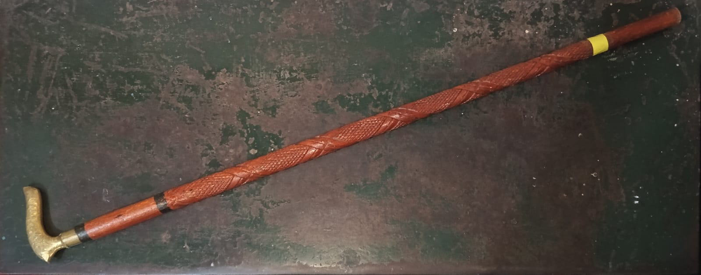

# Hardware Setup Guide

To successfully replicate the HARD, NDT (Hollowness using Acoustic Relative Detection, Non-Destructive Testing) experiment, your physical hardware setup must align with the pipeline's assumptions.

## 1. The Acoustic Probe (The Stick)
*   **Material:** Must be rigid enough to transfer high-frequency acoustic resonance. A dense wooden dowel or a specialized NDT tapping stick works best. (Do NOT use a metal rod, as the metal itself will resonate and pollute the audio with its own high frequencies, masking the floor's resonance).
*   **Marker Placement:** Wrap a band of **highly visible yellow (default) tape** near the bottom of the stick (but not perfectly at the tip). The OpenCV pipeline uses an HSV mask (`hsv_lower` / `hsv_upper`) to track this specific color.

## 2. The Camera (Computer Vision)
*   **Position:** Place the camera on a stable tripod. It must NOT move during the scan.
*   **Perspective:** The camera should be aimed obliquely at the floor being scanned. The PyVista 3D renderer will reconstruct this perspective based on the video bounds.
*   **Lighting:** Ensure the room is well-lit so the yellow tape is clearly isolated from the background.

## 3. The Microphone (Audio DSP)
*   **Type:** A standard mobile smartphone microphone is sufficient, as this is what the current pipeline has been extensively tested on.
*   **Syncing:** If you use an external microphone, the pipeline supports syncing. Name the audio file exactly the same as the video file (e.g., `scan_001.mp4` and `scan_001.wav`) and place them in the same directory. The pipeline will automatically prioritize the high-fidelity `.wav` file over the video's compressed audio track. If no external audio is provided, FFmpeg will automatically extract the `.wav` track from the video.

## 4. Execution Workflow
1.  **Start Recording**: Begin recording video and audio.
2.  **Calibration Knocks**: Strike a known **SOLID** section of the floor 5 times, leaving about ~1 second of silence between each tap. This trains the baseline algorithm.
3.  **Grid Scan**: Systematically tap the area you want to analyze. Maintain a steady rhythm (about 0.5s between strikes) to prevent acoustic echoes from overlapping in the FFT window.
